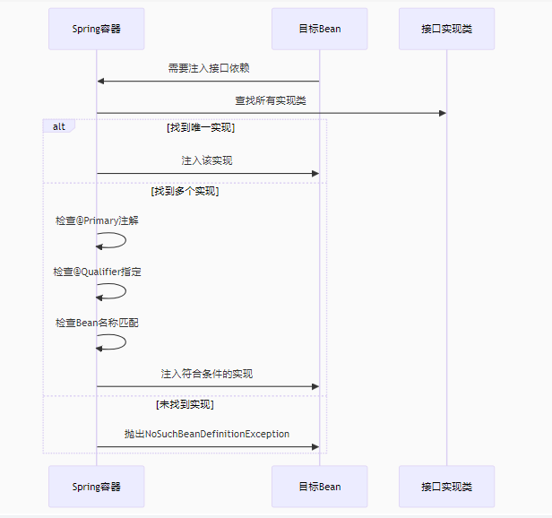

# MiniSpring简介

实现简单的依赖注入和控制反转功能。

* ApplicationContext容器初始化注解含有@controller,@service,@value,@repository,@component的类
* 扫描含有注解@Auwired和@Value的字段，实现依赖注入，根据类型匹配，自动查找接口实现类。
* 使用cglib代理实现controller的权限的拦截

---

## Spring依赖解析过程

